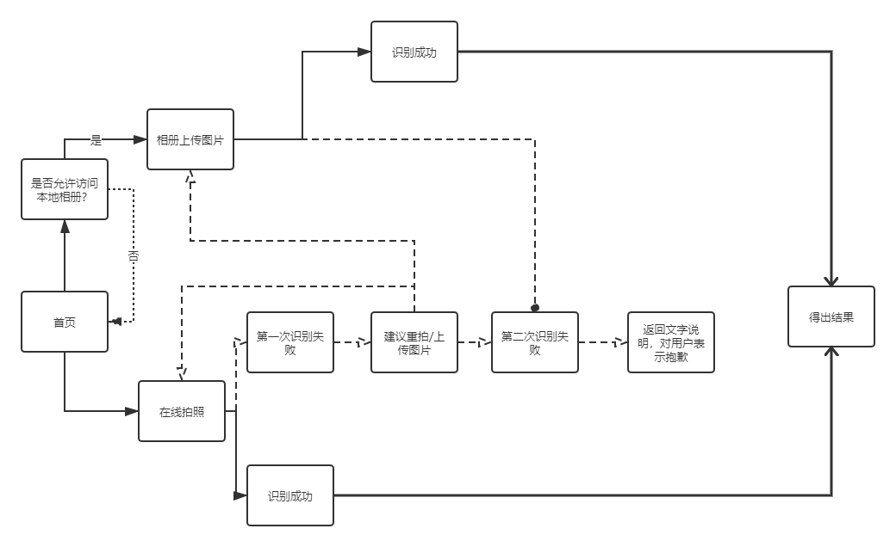

# 微信图像识别功能

## 一、PRD价值主张设计

### PRD1.加值宣言

- 通过**图像识别api**解决生活中所遇到的事物盲区。

### PRD2.核心价值

- 准确识别图片中的物体类别，接口返回识别物体的名称及百度百科信息。

### PRD3.核心价值&用户痛点

1. 在生活中，大多数人对事物的认知是很薄弱的，例如植物动物红酒果蔬等等，特别是在花海、地方植物区没有特定标注名称的地方。
    - 人们遇到美的事物总是有一定的求知欲。

2. 当外出遇到一颗很漂亮的树时想知道这棵树的名称便去描述搜索也很难从无数种植物中找到。
    - 搜索引擎很难通过用户描述事物的特征，特别的动植物，给出准确的答案。

3. 外出吃饭时想知道菜品的热量，可是没有下载有关检测热量的app
    - 若在大众日常使用的app中加入图像识别的功能，会让大众更加地便利。

### PRD4.人工智能概率性与用户痛点

1.  用户遇到会动的物体时拍照不稳定导致识别出问题
-  * _如何解决？_

     建议用户先用手机原相机拍到相对清晰的照片再上传至图像识别。

2. 有些原创独特的菜品无法识别，数据库无此菜品信息
- * _如何解决？_

     当识别不到时，建议用户输入菜品中的原材料，搜索引擎结合得出相似的菜品信息。
     
3. 当驱车驶过遇到好看的植物可不够时间拍照
- * _如何解决？_

     建议用户使用关键词描述，得出相似结果供用户选择。

### PRD5.需求列表与人工智能API加值

| Behavior                       | Issue                            | API      |
| ------------------------------ | -------------------------------- | -------- |
| 对物件进行拍照识别       | 物体会移动导致拍照模糊           | 图像识别 |
| 当图像识别不了且用户打字有困难时       |  | 语音搜索 |

## 二、原型

### 原型1.交互及界面设计

1. 首页：用户在此页面进入语音合成功能页面

2. 输入文字页面：针对多动症患者，我们在页面左侧设置已有的句子供他们选择使用，减少注意力不集中问题；右侧也可让他们直接打字输入。若在此页面直接提交，返回的结果是默认的标准女声。

3. 设置：在此页面用户可是设置想要合成的声音

4. 提交成功：此页面是提交后的语音合成结果显示，可返回首页无限次使用。

### 原型2.信息设计

### 原型3.原型文档

- [产品原型交互](http://nfunm071.gitee.io/api_museum_individual)

## 三、API 产品使用关键AI或机器学习之API的输出入展示

### API1.使用水平

| 输入                       | 输出                            | API      |
| ------------------------------ | -------------------------------- | -------- |
| 用户对准物品进行识别      | 物体名称及百科信息           | 百度图像识别 |
| 用户对准物品进行识别       | 图像打标签/场景识别          | 阿里图像识别 |
| 用户描述物体特征   | 百度搜索结果           | 百度语音搜索 |

### API2.使用比较分析

- [百度、阿里、旷视图像文字识别](https://blog.csdn.net/wwdwjm/article/details/76608101)这是一篇图像文字识别的对比。里面作者得出结果并提出：“百度的识别率最高。”

- [阿里云图像识别产品文档](https://ai.aliyun.com/image?spm=a2c4e.11155472.1280361.261.56c1220a5Qno1r)此页面有说明阿里云产品与服务，它主要的服务是图像打标和场景识别
- [百度图像识别产品文档](https://ai.baidu.com/tech/imagerecognition)此页面是百度图像识别的产品与服务，它可以识别通用物体、场景、动物、植物、品牌logo、果蔬、菜品以及红酒，而且它识别后返回的结果是百度百科的名称和信息。

**总结：**相对于阿里云的图像识别，百度图像识别会更符合此功能想要返回的结果显示，而且百度图像识别物体的范围更广，并且有细分动物植物等专业领域的学科学名，这对于大众来说是一次很好的知识反馈。

| 公司 | API             | 定价                 |
| ---- | --------------- | ------------------------ |
| 百度 | 百度图像识别API | 500次/日的免费额度，超出按调用量计费 |
| 阿里云 | 阿里云图像识别API     | 可免费体验，计费方式有两种，后付费和预付资源包。                   |

**百度**：根据拍摄照片，识别图片内容。支持多种垂类业务场景的细粒度图像识别，精准识别超过十万种物体和场景，基于百度海量数据，持续丰富接口返回内容信息。

 *应用场景*：拍照识图、图片内容检索、相册分类、内容及广告推荐等
  
**阿里云**：支持实时识别，可识别上千种标签，覆盖日常生活各种场景，并实现自动化的视频内容检索服务、个性化推荐、内容检索服务、审查和分发。

 *应用场景*：智能相册、视频场景分析等

- 通过图像识别的识别率、计费方式、限制等对比得出百度图像识别API会更适合此次功能图像识别的调用。

### API3.使用后风险报告

| 类别     | 现在                                                           | 未来                                                     |
| -------- | -------------------------------------------------------------- | -------------------------------------------------------- |
| 图像识别 | 目前已运用在医学技术等生活方面 | 可进一步提高准确度，用于精确的技术研发方面 |
| 语音搜索 | 正在发展中，还不完善                    | 搜索行业发展的一个趋势     |

- 图像识别和语音搜索在人工智能和机器学习中都处于完善阶段，相对来说，图像识别技术会比语音搜索稍微超前一点，但两者未来发展前景应会逐步提高。

| 类别     | 选用公司 | 竞争者           |
| -------- | -------- | ---------------- | 
| 图像识别 | 百度   | 阿里云 |  
| 语音搜索 | 百度     | 微软    |

- 语音搜索目前还处于相对不完善的状态，开发对于公司来说超级困难，除非有很好的突破点。而图像识别需要的数据量很大，目前公司蛮难实现收集各类数据。
